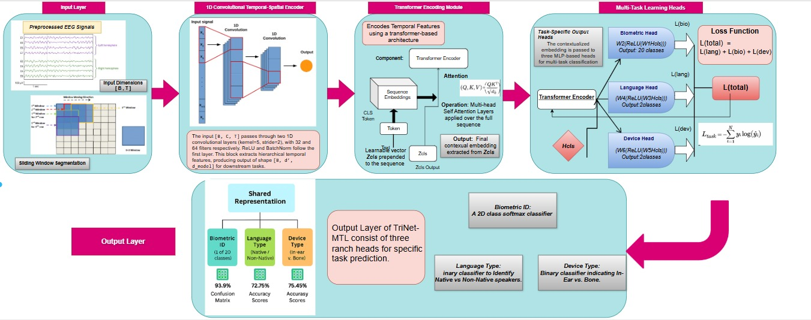

# 🧠 TriNet-MTL: A Multi-Branch Deep Learning Framework for Biometric Identification and Cognitive State Inference from Auditory-Evoked EEG

This repository contains the codebase for **TriNet-MTL**, a multi-task learning (MTL) Transformer-based architecture designed to simultaneously classify:

- 👤 **Biometric Identity** (20 subjects)
- 🗣️ **Language Condition** (Native vs. Non-native auditory stimulus)
- 🎧 **Device Modality** (In-ear vs. Bone-conduction headphones)

The model learns shared temporal representations from auditory-evoked EEG signals and branches into task-specific heads for joint optimization.

---

## 🖼️ Architecture

<p align="center">
  
</p>

---

## 📦 Installation

Clone the repository and install the required Python packages:

```bash
git clone https://github.com/Noor-Fatima-Afzal/TriNet-MTL.git
cd eeg-multitask-transformer
pip install -r requirements.txt
